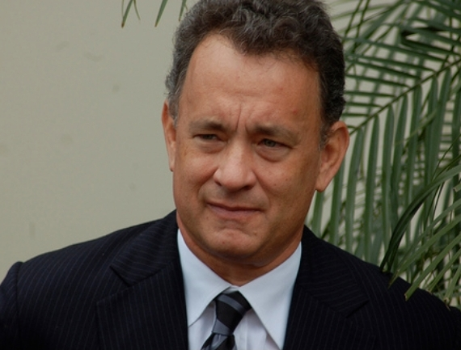
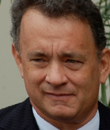
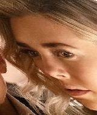

## Content
- [Project Description](#project-description)
- [Code Description](#code-description)
    - [Read image](#read-image)
    - [Get anchor point](#get-anchor-point)
    - [Set the converted template anchor point](#set-the-converted-temlate-anchor-point)
    - [Caculate Affine Transform](#caculate-affine-transform)
    - [Generate a new image according to the given template](#Generate-a-new-image-according-to-the-given-template)
    - [Save image](#save-image)
- [Result](#result)

## Project Description
Affine Transform in geometry means a linear transformation of one vector space, followed by a translation of another.

## Code Description
### Read image
```
img = cv2.imread(img_path)
```
### Get anchor point
```
points = get_points(img)
origin_points = np.float32(points)
```
### Set the converted template anchor point
```
trans_points = np.float32([[65, 90, 1], [95, 90, 1], [80, 120, 1]])
```
### Caculate Affine Transform
```
a = np.dot(f,g.T)
b = inv(np.dot(g, g.T))
M = np.dot(a,b) 
```
### Generate a new image according to the given template
```
new_img = np.zeros((190, 160, 3))
for i in range(new_img.shape[0]):
    for j in range(new_img.shape[1]):
        new_pixel = np.float32([j, i, 1]).reshape(-1,1)
        original_pixel=np.dot(M, new_pixel)

        # turn negative numbers into 0
        original_pixel = np.where(original_pixel>0, original_pixel, 0)

        # Corresponding back to the original picture pixel
        new_img[i, j] = img[int(original_pixel[1]), int(original_pixel[0])]
```
### Save image
```
cv2.imwrite(save_path, new_img)
```

## Result
- original image/processed image


<p float="left">
      
      
       
</p>
